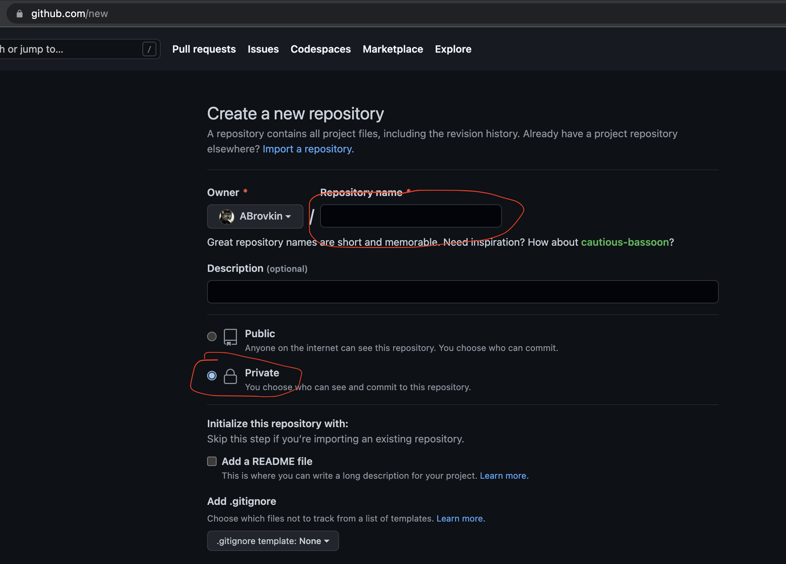
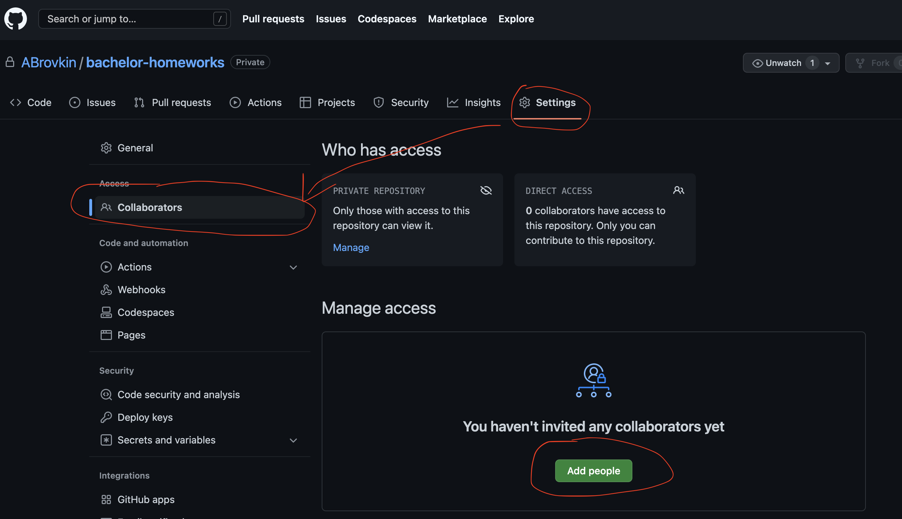
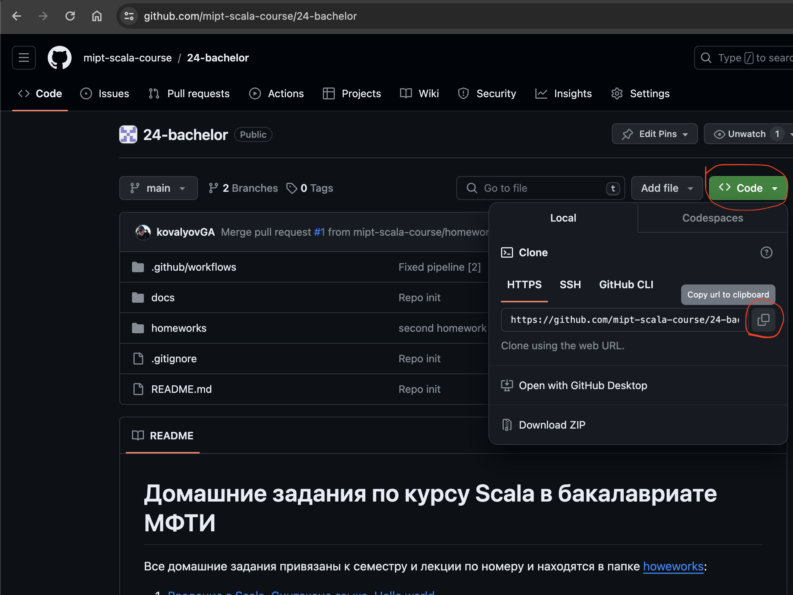
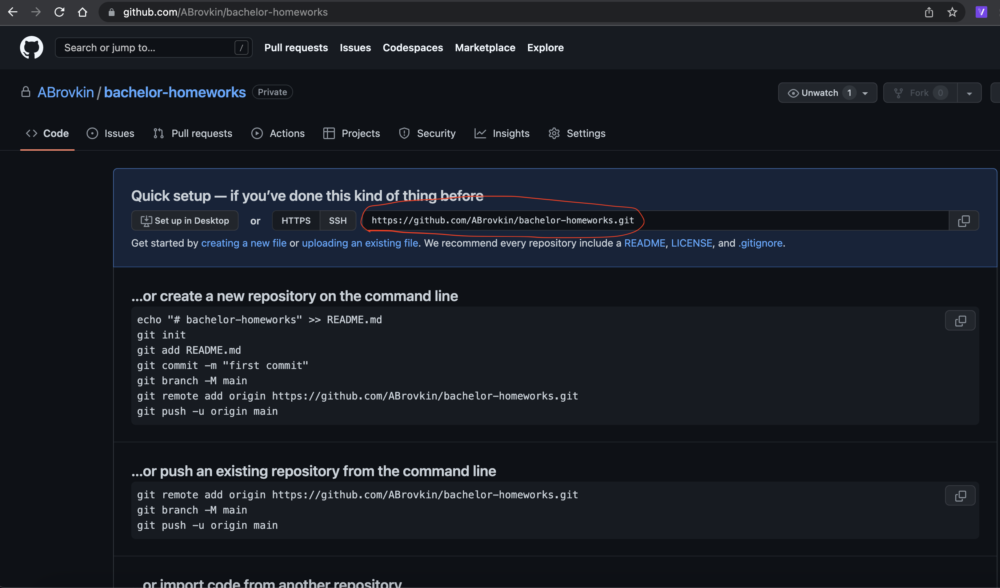
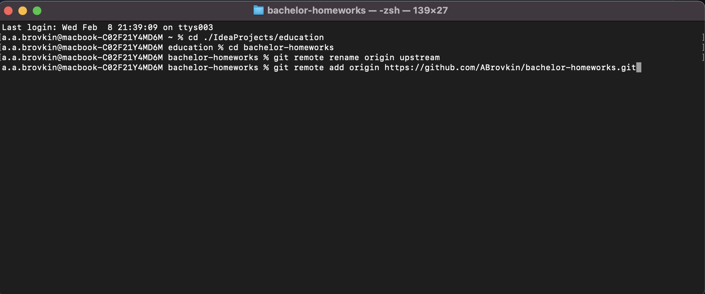

# Создание приватного форка репозитория с домашними заданиями

Репозитории в git можно fork-ать, то есть делать его полную копию с возможностью синхронизации с начальным репозиторием. 
Этот механизм похож на ветки, но отличается тем, что форк может иметь свои настройки доступа и видимости и может существовать независимо от изначального репозитория.

Гитхаб не позвляет создавать приватные форки через кнопку Fork, поэтому придет делать форк вручную. К счастью, это не сложно.

### Подготовка проекта

1. Создать у себя в профиле пустой приватный репозиторий - [https://github.com/new](https://github.com/new)
   1. Назвать `bachelor-homeworks` (или как хотите)
   2. Сделать его приватным
   3. Добавлять никаких файлов не надо
   
   4. Далее перейти в настройки репозитория, в раздел Collaborators
   
   5. Нажав `Add people`, добавить в свой проект своего преподавателя
2. Скопировать ссылку на клонирование с главной страницы репозитория с заданием
   
3. В окне Intellij выбрать Get from VCS
   
4. В поле `Ссылка` вставить скопированный линк
   1. IDEA может написать, что не установлен GIT, тогда следует нажать кнопку `Скачать и установить`
5. Нажать кнопку `Clone`, желательно, чтобы итоговый путь до проекта не содержал русских символов и пробелов
6. Далее необходимо добавить ваш репозиторий в качестве основного, подменив наш.
   1. Скопировать ссылку на ваш репозиторий
   
   1. Windows 
      1. открыть приложение Git CMD
   2. Linux / MacOS
      1. открыть терминал
   3. Перейти в директорию с проектом
   4. ввести следующие команды по очереди:
      1. `git remote rename origin upstream`
      2. `git remote add origin <ссылка на ваш репозиторий>`
   
7. ***Далее необходимо сделать `push` в свой пустой репозиторий - `git push origin` в терминале гита или через UI intellij, ничего не изменяя. Так вы добавите актуальную ветку main к себе проект.***

> Обратите на последний шаг внимание - если этого не сделать, то main не будет основной веткой.

### Регистрация на портале образования

1. Зарегистрироваться на [https://edu.tinkoff.ru/](https://edu.tinkoff.ru/);
2. Присоединиться к курсу

### Работа над заданием
1. Перед выполнением задания нужно обновить ветку `main` из `upstream`. Для этого нужно перейти на ветку main и выполнить команду `git pull upstream` или вызвать pull из меню IDEA.
2. Запушить ветку `main` в свой репозиторий на github (команда `git push origin`)
> Если этого не сделать, то не получится сделать Pull Request с результатом задания!
3. Создать от ветки `main` локальную ветку с именем `homeworks/sN-MM`, где N - номер семестра (1 или 2), а MM - двузначный номер лекции (то есть название ветки - путь к папке домашнего задания), где написать решение
4. Запушить эту ветку в свой форк на github и создать Pull Request в ветку задания
 
Когда вы создадите Pull Request на гитхабе, нужно сдать соответствуещее ей задание в этом курсе - просто прикрепите в поле для ответа ссылку на ваш PR. Баллы за задание тоже будут там.
1. Перейдите на страницу нужной практики

2. Вставьте в поле "Ответ" ссылку на ваш PR и отправьте работу

## Работа с github по SSH

При работе по https необходимо вводить логин и пароль, сохранять его на локальной машине в настройках git и т.д. 
Чтобы этого не делать, можно воспользоваться функциональностью создания и добавления SSH-ключа в github.

### Создание SSH ключа

1. Windows
   1. Открыть cmd.exe
   2. Ввести команду `ssh-keygen -b 2048 -t rsa`
   3. Если не сработало, то надо установить клиент OpenSSH:
      1. Открыть Настройки > Приложения > Приложения и возможности > Дополнительные компоненты
      2. Нажать сверху "Добавить компонент" и там через поиск установить "Клиент OpenSSH".
   4. Проследовать всем пунктам установки, пароль устанавливать смысла нет, менять путь тоже не стоит
   5. После завершения будет сгенерирована пара файлов - `id_rsa` и `id_rsa.pub`, путь к ним был указан в процессе установки
   6. Необходимо скопировать в буфер обмена содержимое файла `id_rsa.pub`
2. Linux / Macos
   1. Открыть терминал
   2. Аналогично windows, начиная с 3-го шага

### Установка SSH ключа в GitHub

1. Перейти на [https://github.com/settings/keys](https://github.com/settings/keys)
2. Нажать на кнопку `New SSH key`
   
3. Дать удобное вам название, например <имя пользователя>_<операционная система>
4. В поле `Key` вставить содержимое файла `id_rsa.pub`
5. Нажать кнопку `Add SSH key`

> Впредь вы сможете взаимодействовать со своим GitHub аккаунтом по SSH - клонировать, пушить и т.д. без ввода пароля
> Для клонирования надо использовать SSH-ссылку вместо HTTPS